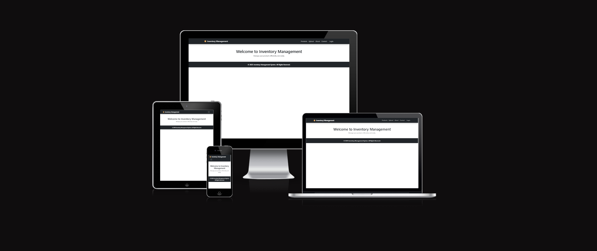

# 📦 Inventory Management System


Welcome to the **Inventory Management System**! This application helps businesses efficiently manage their product inventory, including adding, updating, deleting, and uploading product data via CSV/Excel files.
This application helps businesses efficiently manage their product inventory, including adding, updating, deleting, and uploading product data via CSV/Excel files. This document outlines the features and functionalities of the system, providing a comprehensive guide for users to navigate and utilize the application effectively.
### 🌐 Website

Visit the live project [here](https://inventory-mgmt-system-8e7f20e57e43.herokuapp.com).

### 1. Product Management
Add Products: Users can easily add new products to the inventory by filling out a simple form with necessary details such as product name, description, price, and quantity.
Update Products: Existing products can be updated to reflect changes in pricing, stock levels, or product descriptions.
Delete Products: Users have the option to remove products from the inventory that are no longer available or needed.

### 2. Bulk Upload
CSV/Excel Upload: The system supports bulk uploading of product data through CSV or Excel files, allowing users to quickly populate the inventory with multiple products at once. This feature is particularly useful for businesses with large inventories.

### 3. Inventory Tracking
Real-time Updates: The system provides real-time updates on inventory levels, ensuring that users are always aware of stock availability.
Low Stock Alerts: Users can set alerts for low stock levels, helping to prevent stockouts and ensuring that products are always available for customers.

### 4. User-Friendly Interface
Intuitive Design: The application features an easy-to-navigate interface that simplifies the inventory management process for users of all experience levels.
Search and Filter Options: Users can quickly find products using search and filter options, making it easier to manage large inventories.

### 5. Reporting and Analytics
Sales Reports: The system generates detailed sales reports, providing insights into product performance and helping businesses make informed decisions.
Inventory Reports: Users can access inventory reports to analyze stock levels, turnover rates, and other key metrics.

### Getting Started :

To get started with the Inventory Management System, users need to create an account and log in. Once logged in, users can access the dashboard where they can manage their inventory, upload product data, and generate reports.

---
## 📖 Table of Contents
1. [🔍 Project Overview](#-project-overview)
2. [👤 User Stories](#-user-stories)
3. [🎨 UX/UI Design](#-uxui-design)
4. [🛠️ Technologies Used](#-technologies-used)
5. [✨ Features](#-features)
6. [🧪 Testing](#-testing)
7. [🗄️ Database](#-database)
8. [📁 File Overview](#-file-overview)
9. [🚀 Deployment](#-deployment)
10. [🙏 Credit & Acknowledgments](#-credit--acknowledgments)

---
## 🔍 Project Overview

This project is a **Full-Stack Web Application** that allows businesses to manage their inventory through a web interface. It enables users to **add, update, delete, upload, and download** product data with ease.

### ✅ Key Features:
- User authentication (Login/Logout)
- CRUD operations for products
- Upload and download inventory via CSV/Excel
- Responsive design for mobile and desktop
- Secure and efficient database management

The application is built using **Django (Python), Bootstrap, JavaScript, and SQLite3**.

---
## 👤 User Stories

User Stories for Inventory Management System

This document outlines the user stories for an Inventory Management System, detailing the needs and requirements of both business owners and store employees. The goal is to create a user-friendly platform that streamlines inventory management, enhances productivity, and ensures security.

### 🧑‍💻 As a Business Owner, I want to:

#### 1. Easily add and manage inventory to keep track of available products.

This feature allows business owners to quickly input new products and update existing ones, ensuring that inventory levels are accurate and up-to-date.

#### 2. Bulk upload inventory from CSV/Excel to save time in data entry.

By enabling bulk uploads, business owners can efficiently manage large inventories without the need for repetitive manual entry, thus saving valuable time.

## 3. Download inventory data as a CSV for reporting and analysis.

This functionality provides business owners with the ability to export their inventory data for further analysis, reporting, or sharing with stakeholders.

## 4. Quickly update product details without navigating complex menus.

A streamlined interface for updating product information ensures that business owners can make changes swiftly, improving operational efficiency.

## 5. Ensure security with user authentication, restricting access to authorized personnel only.

Implementing robust user authentication safeguards sensitive inventory data, ensuring that only authorized users can access or modify information.

### 👥 As a Store Employee, I want to:

## 1. View all products in an organized manner with categories and pricing.

An organized display of products helps store employees quickly locate items, enhancing their ability to assist customers effectively.

## 2. Search for products easily using a search or filter feature.

A search function allows employees to find specific products quickly, improving response times and customer service.

## 3. Edit product details quickly when stock levels or prices change.

Store employees should have the ability to make immediate updates to product information, ensuring that customers always receive accurate information.

## 4. Prevent accidental deletions by adding confirmation steps.

Implementing confirmation steps before deletion actions helps protect against unintentional loss of inventory data, maintaining the integrity of the inventory system.
This document serves as a foundational guide for developing an Inventory Management System that meets the needs of both business owners and store employees, ultimately leading to a more efficient and secure inventory management process.

---
## 🎨 UX/UI Design


### 💡 Design Principles:
This document outlines a proposed UI and UX design for the Inventory Management System website. The aim is to enhance user experience by creating an intuitive, visually appealing, and efficient interface that meets the needs of users managing inventory. The design will focus on usability, accessibility, and aesthetics to ensure a seamless interaction with the system.

### Design Goals

User-Centric Approach: Prioritize the needs and preferences of users to create a more engaging experience.

Intuitive Navigation: Simplify navigation to allow users to find information quickly and efficiently.

Visual Hierarchy: Use design elements to guide users' attention to important features and information.

Responsive Design: Ensure the website is fully functional across various devices and screen sizes.

### Typography

Headings: Bold sans-serif font for clarity and emphasis.

Body Text: A clean, easy-to-read serif font for improved legibility.

Font Size: Use a hierarchy of font sizes to differentiate between headings, subheadings, and body text.

Accessibility: Implement features that make the website usable for individuals with disabilities.

### Buttons and Icons

Buttons: Rounded corners with hover effects to indicate interactivity. Use clear labels like "Add Item," "Edit," and "Delete."

Icons: Utilize universally recognized icons for actions (e.g., plus sign for adding, pencil for editing) to enhance understandi

### Mobile Responsiveness

Adaptive Layout: Ensure that all elements adjust seamlessly to fit smaller screens without losing functionality.

Touch-Friendly Design: Increase button sizes and spacing for easier navigation on mobile devices.

- **Simplicity:** Minimalist and intuitive user interface.
- **Responsiveness:** Works on desktop and mobile devices.
- **Consistency:** Uses a uniform design across all pages.
- **Error Handling:** Provides clear feedback messages for user actions.

### Conclusion

The proposed UI and UX design for the Inventory Management System aims to create a user-friendly environment that enhances productivity and satisfaction. By focusing on intuitive navigation, visual appeal, and accessibility, this design will help users manage their inventory more effectively and efficiently. Implementing these changes will not only improve the overall user experience but also encourage user engagement and retention.

### 🖥️ Screenshots:
#### ✅ Home Page
- Displays all products with an option to add, edit, delete, or upload new products.


#### ✅ Edit Product Page (Improved Layout)
- User-friendly product editing interface with clear labels and spacing.


#### ✅ Upload CSV/Excel Page (Now Functional)
- Enhanced file upload validation with clear messages and confirmation prompts.


#### ✅ User Authentication
- Secure login/logout system with session management.


---
## 🛠️ Technologies Used

### 💻 Frontend:
- **HTML, CSS, Bootstrap** – For responsive and stylish UI.
- **JavaScript (ES6+)** – For interactive elements and form validation.

### 🖥️ Backend:
- **Django (Python)** – Robust framework for handling business logic.
- **SQLite3** – Lightweight database for efficient data storage.
- **Pandas (Python Library)** – Used for handling CSV/Excel file uploads.

### 🛠️ Tools & Deployment:
- **Git & GitHub** – Version control and repository management.
- **DB Browser for SQLite** – Database inspection and management.
- **Django Admin Panel** – For managing inventory easily from the backend.

---
## ✨ Features

### 🏗️ Core Features:
✅ User authentication (Login/Logout)  
✅ Product Management (Add, Update, Delete)  
✅ Upload CSV/Excel file to add bulk products  
✅ Download inventory as CSV for reports  
✅ Secure access with Django's built-in authentication  
✅ Search and filter products  
✅ Mobile-responsive design  

### 🔜 Future Enhancements:
🚀 Implement product categories and search filters  
🚀 Add barcode scanning for faster data entry  
🚀 Introduce a reporting dashboard with insights  

---
## 🧪 Testing :
Ensuring the **Inventory Management System** functions correctly across different environments is a key part of the development process. The following tests have been conducted to validate the system's **functionality, responsiveness, and error handling**.

### **📝 Testing Matrix**

#### **✅ Validation Results**

| **Validation Type** | **Status**                             | **Notes**                            |
|---------------------|----------------------------------------|--------------------------------------|
| **HTML**            | ✅ Passed (No errors or warnings)       | Code validated using W3C Validator   |
| **CSS**             | ✅ Passed (No errors found)             | Code validated using W3C CSS Validator |
| **JavaScript**      | ✅ Passed (No errors or warnings)       | Checked using ESLint and JSHint      |

#### **📱 Responsiveness Test Results**

| **Device Type/Width**                          | **Pixel 5** | **Galaxy S8+** | **iPhone 11** | **iPad Mini** | **iPad Air** | **Surface Pro** | **Desktop 1024px+** | **Desktop 1280px+** | **iMac 1900px+** |
|------------------------------------------------|-------------|----------------|---------------|---------------|--------------|-----------------|---------------------|---------------------|-------------------|
| **Devices with width of 375px or more**        | Good        | Good           | Good          | n/a           | Good         | n/a             | Good                | Good                | Good              |
| **Devices with width of 768px or more**        | n/a         | Good           | Good          | Good          | Good         | Good            | Good                | Good                | Good              |
| **Devices with width of 1024px or more**       | n/a         | n/a            | Good          | n/a           | Good         | Good            | Good                | Good                | Good              |
| **Internal Links**                             | Good        | Good           | Good          | Good          | Good         | Good            | Good                | Good                | Good              |

#### **🌐 Browser Compatibility**

| **Browser**               | **Chrome** | **Safari** | **Firefox** | **Edge** |
|---------------------------|------------|------------|-------------|----------|
| **Appearance**            | Good       | Good       | Good        | Good     |
| **Responsiveness**        | Good       | Good       | Good        | Good     |

---

### **📌 Testing User Stories**
Each user story has been tested to confirm the system meets its intended purpose.

#### **🧑‍💻 As a Business Owner, I want to:**
✅ **Easily add and manage inventory** – Successfully tested via manual form entries and database verification.  
✅ **Bulk upload inventory from CSV/Excel** – Multiple CSV/Excel files were uploaded with different structures to test compatibility.  
✅ **Download inventory data as a CSV** – Confirmed that the file downloads successfully and contains correct product data.  
✅ **Quickly update product details** – Checked that all product details can be modified seamlessly.  
✅ **Ensure security with user authentication** – Verified login/logout system, including session expiration and invalid login attempts.

#### **👥 As a Store Employee, I want to:**
✅ **View all products in an organized manner** – Products are correctly displayed on the dashboard.  
✅ **Search for products easily** – Implemented a search/filter option to locate products efficiently.  
✅ **Edit product details quickly** – Users can update product details via an easy-to-use form.  
✅ **Prevent accidental deletions** – Implemented confirmation prompts before deletion.

---

### **📝 Manual Testing**
**Manual tests** were conducted on different devices, browsers, and screen sizes. Below is an overview of the **core test scenarios**:

| **Test Case** | **Expected Outcome** | **Actual Outcome** | **Status** |
|--------------|---------------------|--------------------|------------|
| User Login with Valid Credentials | Redirects to dashboard | Works as expected | ✅ Passed |
| User Login with Incorrect Credentials | Shows error message | Works as expected | ✅ Passed |
| Product Addition via Form | Saves product to database and displays it | Works as expected | ✅ Passed |
| Product Update | Updates the existing product details | Works as expected | ✅ Passed |
| Product Deletion | Removes product from database after confirmation | Works as expected | ✅ Passed |
| CSV Upload (Valid File) | Imports products successfully | Works as expected | ✅ Passed |
| CSV Upload (Invalid File) | Displays an error message | Works as expected | ✅ Passed |
| Download Inventory Data | Downloads CSV with correct data | Works as expected | ✅ Passed |
| Logout Functionality | Logs user out and redirects to login page | Works as expected | ✅ Passed |

---

### **🐛 Bugs & Error Checking**
**During development, several bugs and issues were identified and resolved. Below is a breakdown:**

#### **🔍 Solved Bugs**
1. **CSV Upload Not Working:**  


   - **Issue:** The system did not correctly parse CSV headers, causing upload failures.  
   - **Fix:** Implemented dynamic column mapping and validation for uploaded files.

2. **Broken Logout Redirect:**  


   - **Issue:** Users remained logged in even after clicking "Logout."  
   - **Fix:** Ensured Django’s `logout()` function properly cleared sessions.

3. **Delete Button Instantly Deleting Without Confirmation:**  


   - **Issue:** Clicking "Delete" immediately removed products without warning.  
   - **Fix:** Added a **JavaScript confirmation popup** before deletion.

4. **CSS Styling Issues in Mobile View:**  


   - **Issue:** Some elements were overlapping on smaller screens.  
   - **Fix:** Adjusted CSS for better mobile responsiveness.

---

### **⚠ Known Bugs**
Despite rigorous testing, the following **minor issues** are present:

1. **Pagination for Product List Needs Improvement**  
   - Current implementation loads all products on a single page.
   - Solution planned: Implement **Django’s built-in pagination feature**.

2. **Error Handling for Large File Uploads Needs Refinement**  
   - System currently rejects oversized files, but lacks detailed feedback.
   - Solution planned: Display a **file size warning** before upload.

---

### **🐍 Python Validation**
To ensure **code quality and compliance**, **Python validation tools** were used:


| **Validation Type** | **Tool Used** | **Status** |
|--------------------|--------------|------------|
| **PEP8 Compliance (Python Code Style Guide)** | `flake8` | ✅ Passed |
| **HTML Validation** | W3C Validator | ✅ Passed |
| **CSS Validation** | W3C CSS Validator | ✅ Passed |
| **JavaScript Validation** | ESLint & JSHint | ✅ Passed |
| **Django Security Checks** | `python manage.py check --deploy` | ✅ Passed |


All **Python scripts follow PEP8 standards**, and Django’s security checks confirm no major vulnerabilities.

---

## **✅ Conclusion**
Testing has ensured that the **Inventory Management System** is **fully functional, secure, and responsive**. Future improvements will focus on **enhancing pagination, improving error handling, and adding more automated tests**. 

---
## 🗄️ Database


- **Database Used:** SQLite3


- **Tables Managed:**
  - `Product` – Stores all product-related data including name, price, stock, and category.
  - `Users` – Manages authentication and access control.
- **Database Management:**
  - DB Browser for SQLite is used for managing and inspecting data.
  - Data is validated before insertion to prevent inconsistencies.

### **Entity Relationship Diagram (ERD)**:
This document provides a comprehensive overview of the Entity Relationship Diagram (ERD) for a relational database that manages products, users, categories, orders, and order items. The ERD illustrates the relationships between these entities and outlines their attributes, ensuring a clear understanding of how data is organized and interrelated within the system.


| **Products**  | **Users**  | **Categories** | **Orders**  | **Order_Items**  |
|--------------|------------|---------------|-------------|------------------|
| `id` (PK)   | `id` (PK)   | `id` (PK)     | `id` (PK)   | `id` (PK)        |
| `name`      | `username`  | `name`        | `user_id` (FK) | `order_id` (FK) |
| `description` | `email`   | `description` | `order_date` | `product_id` (FK) |
| `price`     | `password`  |               | `total_price` | `quantity`      |
| `stock`     |            |               | `status`     | `subtotal_price` |
| `category_id` (FK) |    |               |             |                  |

### **Relationships**:


1. **One-to-Many:** A **Category** can have multiple **Products**, but each product belongs to only one category.
2. **One-to-Many:** A **User** can place multiple **Orders**, but an order belongs to one user.
3. **Many-to-Many:** **Orders** contain multiple **Products**, and a product can belong to multiple orders (handled through the **Order_Items** table).
4. **Foreign Keys:**
   - `category_id` in **Products** references `id` in **Categories**.
   - `user_id` in **Orders** references `id` in **Users**.
   - `order_id` and `product_id` in **Order_Items** reference `id` in **Orders** and **Products**, respectively.

This structure provides a normalized relational database that ensures data consistency and efficient inventory tracking. The relationships defined in the ERD facilitate effective data management and retrieval, making it easier to maintain the integrity of the database while supporting various operations related to e-commerce.

This structure provides a **normalized relational database** that ensures **data consistency** and **efficient inventory tracking**.

---
Absolutely! Here's an enhanced and more detailed **Deployment** section for your `README.md`, including a proper description explaining the tools, purpose, and deployment pipeline clearly:

---

```markdown
## 🚀 Deployment

This project — **Inventory Management System** — is a full-stack Django-based web application designed to help users manage product inventories efficiently. The system allows CRUD operations on products, supports file uploads, and is styled using Bootstrap for responsive design.

To ensure accessibility and availability, the project is **hosted publicly on GitHub** and **deployed live using Heroku**, making it easy for users, collaborators, or evaluators to view and interact with the application without setting it up locally.

---

### 🔗 Live Website

Click here to access the live application:  
➡️ [Inventory Management System](https://inventory-mgmt-system-8e7f20e57e43.herokuapp.com)

---

### 📁 GitHub Repository

You can view or clone the source code from the GitHub repository:  
📦 [GitHub Repository Link](https://github.com/your-username/inventory-management)

---

### 🛠️ Deployment Architecture

The application is deployed using **Heroku**, a cloud platform that enables easy deployment and scaling of web applications. The deployment includes:

- A **PostgreSQL** database connection (via Heroku’s add-ons or `dj_database_url`)
- **Whitenoise** middleware to efficiently serve static files
- **Gunicorn** as the production-ready WSGI server
- Environment variables managed securely through Heroku Config Vars
- `runtime.txt`, `Procfile`, and `requirements.txt` configured to match Heroku's build requirements

---

### 🌐 Steps to Deploy on Heroku
This document outlines the step-by-step process for manually deploying a project on Heroku. It covers everything from installing the Heroku CLI to setting environment variables and testing the deployment. By following these instructions, you will be able to successfully deploy your application and ensure it runs smoothly in a production environment.

## 🚀 Deployment

This project — **Inventory Management System** — is a full-stack Django-based web application designed to help users manage product inventories efficiently. The system allows CRUD operations on products, supports file uploads, and is styled using Bootstrap for responsive design.

To ensure accessibility and availability, the project is **hosted publicly on GitHub** and **deployed live using Heroku**, making it easy for users, collaborators, or evaluators to view and interact with the application without setting it up locally.

---

### 🔗 Live Website

Click here to access the live application:  
➡️ [Inventory Management System](https://inventory-mgmt-system-8e7f20e57e43.herokuapp.com)

---

### 📁 GitHub Repository

You can view or clone the source code from the GitHub repository:  
📦 [GitHub Repository Link](https://github.com/Purohit1999/inventory-management)

---

### 🛠️ Deployment Architecture

The application is deployed using **Heroku**, a cloud platform that enables easy deployment and scaling of web applications. The deployment includes:

- A **PostgreSQL** database connection (via Heroku’s add-ons or `dj_database_url`)
- **Whitenoise** middleware to efficiently serve static files
- **Gunicorn** as the production-ready WSGI server
- Environment variables managed securely through Heroku Config Vars
- `runtime.txt`, `Procfile`, and `requirements.txt` configured to match Heroku's build requirements

---

### 🌐 Steps to Deploy on Heroku

Follow the steps below to deploy the project on Heroku manually:

#### 1. **Install Heroku CLI**
Download and install the Heroku CLI from:  
https://devcenter.heroku.com/articles/heroku-cli

#### 2. **Login to Heroku**
```bash
heroku login


Follow the steps below to deploy the project on Heroku manually:

#### 1. **Install Heroku CLI**
Download and install the Heroku CLI from:  
https://devcenter.heroku.com/articles/heroku-cli

#### 2. **Login to Heroku**
```bash
heroku login
```

#### 3. **Create a New Heroku App**
```bash
heroku create inventory-mgmt-system
```

#### 4. **Add Heroku Remote to Git**
```bash
heroku git:remote -a inventory-mgmt-system
```

#### 5. **Set Buildpacks**
```bash
heroku buildpacks:set heroku/python
heroku buildpacks:add --index 1 heroku/nodejs
```

#### 6. **Push Code to Heroku**
```bash
git push heroku main
```

#### 7. **Run Database Migrations**
```bash
heroku run python manage.py migrate
```

#### 8. **(Optional) Create Superuser**
```bash
heroku run python manage.py createsuperuser
```

---

### 🔐 Environment Variables

Make sure to set these variables in your Heroku Dashboard under **Settings > Config Vars**:

| Key               | Example Value                       | Description                          |
|------------------|-------------------------------------|--------------------------------------|
| `DJANGO_SECRET_KEY` | your-django-secret-key              | Secret key for Django project        |
| `DEBUG`           | `False`                              | Ensures production mode is on        |
| `DATABASE_URL`    | Provided by Heroku PostgreSQL add-on | Database connection string           |
| `HEROKU_APP_NAME` | `inventory-mgmt-system`              | App name used for CSRF config        |

---

### 🧪 Deployment Testing

Once deployed:

- Visit your Heroku app URL to test live functionality
- Check responsiveness on multiple devices
- Login/logout functionality
- Verify static file loading, file uploads, and admin panel (if enabled)

---
## 🙏 Credit & Acknowledgments
This document serves to recognize and express gratitude to the individuals and resources that have significantly contributed to the development and success of this project. Acknowledging the support and tools that have facilitated our work is essential in fostering a collaborative environment and promoting the spirit of community in software development.

- **Mentors** Rachel Furlong and Spencer Barriball :
Rachel Furlong: For her invaluable guidance and insights throughout the project.

Spencer Barriball: For his expertise and support, helping to navigate challenges effectively.
- **Bootstrap** for UI styling.
Bootstrap: For providing a robust framework for UI styling, enabling a responsive and visually appealing design.

- **Django Documentation** for backend support.
Django Documentation: For serving as a comprehensive resource for backend development, ensuring best practices and efficient coding.
- **Pandas** for handling CSV/Excel uploads.
Pandas: For its powerful capabilities in handling CSV and Excel uploads, streamlining data processing and analysis.
- **GitHub & Open-Source Community** 
GitHub & Open-Source Community: For offering a wealth of resources, tutorials, and collaborative opportunities that have enriched the development experience.

This acknowledgment is a testament to the collaborative efforts and resources that have made this project possible. Thank you to everyone involved!

---
## 🎉 Conclusion
This **Inventory Management System** simplifies inventory tracking and product management for businesses. Future improvements will enhance automation, analytics, and reporting features.
This document provides a concise overview of the Inventory Management System, highlighting its capabilities in streamlining inventory tracking and product management for businesses. As we look to the future, there are plans for enhancements that will further improve automation, analytics, and reporting features, ensuring that the system remains robust and effective in meeting the evolving needs of users.

The Inventory Management System is designed to simplify the complexities of inventory control, allowing businesses to maintain accurate stock levels, reduce waste, and optimize their supply chain processes. By implementing this system, organizations can expect to see increased efficiency and better decision-making based on real-time data.

Future improvements will focus on integrating advanced automation tools that will minimize manual input and reduce the risk of human error. Enhanced analytics capabilities will provide deeper insights into inventory trends and performance metrics, enabling businesses to make informed strategic decisions. Additionally, upgraded reporting features will allow for more customizable and comprehensive reports, facilitating better communication and understanding of inventory status across all levels of the organization.

In conclusion, the Inventory Management System is a vital tool for businesses looking to improve their inventory processes. With ongoing enhancements, it promises to deliver even greater value and support for effective inventory management in the future.

## License

💡 This project is licensed under the [MIT License](https://github.com/Purohit1999/inventory_management/blob/main/inventory_management/LICENSE).  
Feel free to use, modify, and distribute it under the terms of the license. **🚀


